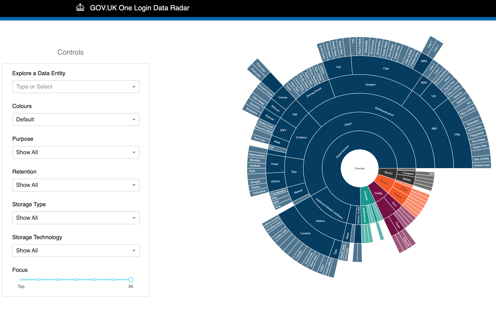

# GOV.UK One Login Data Radar



### Contents
- [Introduction](#govuk-one-login-data-radar)
- [About the data radar](#about-this-project)
  - [What is in the Data Radar](#what-is-in-the-data-radar)
  - [How the information is represented](#how-the-information-is-represented)
  - [How the data is organised](#how-the-data-is-organised)
  - [How the data is captured and prepared](#how-the-data-is-captured-and-prepared)
  - [Data Radar Features](#data-radar-features)
- [Application Development](#application-development)
  - [Deployment](#deployment)
  - [Security](#security)
- [Maintenance and Future use](#maintenance-and-future-use)
- [Contact](#contact)

##  GOV.UK One Login Data Radar
Welcome to the **GOV.UK One Login Data Radar**. This repository provides an interactive and visual tool that helps you explore how data is used within GOV.UK One Login. The Data Radar allows you to see different types of information collected, why it is needed, and how it is managed, all in a clear and user-friendly way.

The Data Radar is intended to help people better understand what data GOV.UK One Login processes and stores. This information is already available to the public in various places, so the Data Radar puts this information in one place and visualises it.


For more details, visit the [GOV.UK One Login documentation](https://www.sign-in.service.gov.uk/documentation/).

## About the Data Radar


The **Public Data Radar** is an **open-source project**, originally developed by **6point6**, to provide an interactive and visual way to explore the the **GOV.UK One Login** data.

- The **codebase** was originally built by **6point6** and has been **customised** for GOV.UK one login use
- You are **free to use, modify, and adapt** this tool to explore and visualise data
- You are free to use this project in the context of commercial engagements, but you cannot take this project and sell it directly

### What is in the Data Radar

The GOV.UK One Login system is built on a clear structure that organises key pieces of information, which we call **data entities**. These data entities are based on reliable, publicly available details from official GOV.UK sources, ensuring that everything is transparent and easy to understand.


The data entities within the Data Radar are derived from the following official sources:

| **Source**                                                | **Description**                                                                         | **Examples of Information**                                                                                                                                                          |
|-----------------------------------------------------------|-----------------------------------------------------------------------------------------|--------------------------------------------------------------------------------------------------------------------------------------------------------------------------------|
| **[Privacy Notice](https://signin.account.gov.uk/privacy-notice)**         | Details what data is collected, retained, and for how long. It includes technical and biometric data not found in other sources                                    |   Basic personal details such as [name](https://signin.account.gov.uk/privacy-notice#:~:text=Name), [date of birth](https://signin.account.gov.uk/privacy-notice#:~:text=Date%20of%20birth), [address](https://signin.account.gov.uk/privacy-notice#:~:text=Address) (for driving licences only), [document number](https://signin.account.gov.uk/privacy-notice#:~:text=Document%20number), [passport face image](https://signin.account.gov.uk/privacy-notice#:~:text=We%20delete%20your%20still%20photo%20generated%20from%20your%20selfie%20video%2C%20driving%20licence%20images%20and%20biometric%20facial%20data%20from%20Iproov%E2%80%99s%20systems%20after%2030%20days.), which is retained for 30 days, [audit store data](https://signin.account.gov.uk/privacy-notice#:~:text=We%20also%20maintain%20a%20secure%20audit%20trail%20of%20all%20GOV.UK%20One%20Login%20audit%20events%20and%20activity%20which%20we%20retain%20for%207%20years%20for%20fraud%20monitoring%20purposes.), which is retained for 7 years, and [device IP address and computer GPS](https://signin.account.gov.uk/privacy-notice#:~:text=technical%20information%20including%20IP%20addresses%2C%20the%20type%20of%20device%20and%20web%20browser%20you%20use), which are used for security and technical purposes |
| **[Additional Information](https://www.gov.uk/government/consultations/draft-legislation-to-help-more-people-prove-their-identity-online/outcome/additional-information-govuk-one-login)** | Explains legislative background and policy context. It covers basic personal details but does not specify retention periods or biometric data                                             | Includes commonly collected personal details such as [name](https://www.gov.uk/government/consultations/draft-legislation-to-help-more-people-prove-their-identity-online/outcome/additional-information-govuk-one-login#:~:text=4.%20Name,accessing%20that%20service.), [password](https://www.gov.uk/government/consultations/draft-legislation-to-help-more-people-prove-their-identity-online/outcome/additional-information-govuk-one-login#:~:text=user%20is%20accessing.-,2.%20Password,No.,-3.%20Phone), [email address](https://www.gov.uk/government/consultations/draft-legislation-to-help-more-people-prove-their-identity-online/outcome/additional-information-govuk-one-login#:~:text=1.%20Email,user%20is%20accessing.), and [date of birth](https://www.gov.uk/government/consultations/draft-legislation-to-help-more-people-prove-their-identity-online/outcome/additional-information-govuk-one-login#:~:text=5.%20Date,accessing%20that%20service.), which are used for authentication when accessing government services |
| **[Technical Documentation](https://docs.sign-in.service.gov.uk/integrate-with-integration-environment/)** | Provides API integration guidance for developers, security standards, and identity verification processes             | Describes how users verify identity through documents such as a [passport](https://docs.sign-in.service.gov.uk/integrate-with-integration-environment/prove-users-identity/#understand-your-user-39-s-passport-claim) or [driving licence](https://docs.sign-in.service.gov.uk/integrate-with-integration-environment/prove-users-identity/#understand-your-user-39-s-driving-licence-claim). Also includes an [Identity Journey Map](https://www.figma.com/design/6D6nLrW4MayhrIaJ4N7FHm/GOV.UK-One-Login-Identity-checking-user-journey-maps) to visualise authentication steps|
| **[Data Vocab](https://vocab.account.gov.uk/)**           | Standardises terminology and data classifications used across GOV.UK One Login                                      | Defines key terms, entity relationships, and metadata structures, ensuring consistency in how data is described and interpreted within the system|


### How the information is represented

The named items in the Data Radar represent information topics at a high level of abstraction.

Like a [conceptual data model](https://en.wikipedia.org/wiki/Conceptual_schema), the Data Radar represents the semantics of an organisation and not a database design. In fact the Data Radar is agnostic of any physical implementation.

### How the data is organised

Most data models show how information relates to other information, with standardised markings to show formal relationships such as 'one-to-many' and whether relations are optional.

The Data Radar does not include this level of detail. It is a hierarchical view, so the only relation between items is parent-child.

This reflects the Data Radar's intended use case as a simple representation to get everyone in the organisation started with understanding the data landscape.

The items in the Data Radar could be reused in an organisation ontology or logical data model that defines more complex relationships and other conditional logic.

### How the data is captured and prepared

This version of the Data Radar includes no automated scanning of the information landscape at the physical layer i.e. it does not scan data stores. A separate plug-in to do this may be a useful feature.

There is nothing to prevent a data landscape that is captured automatically from being visualised in the Data Radar, although if one is using an automated scanning tool then that tool may have its own visualisation capability.

The information in the Data Radar is more likely to be populated manually. This is intentional, and has two advantages:

* it means having conversations across the organisation to discover the landscape and iterating over the view to refine it - the starting point may even be a whiteboard
* the data input is a spreadsheet, which makes it easier for people who do not know python to make updates to the data landscape

### Data Radar Features

The Data Radar is designed to help you explore and interact with data in an intuitive way. Here's how you can use it:

- **Search for data entities**: Easily find any data entity and view its attributes, including what it’s derived from and what it contains
- **Zoom in and out**: Use the scroller to adjust the level of detail you see, similar to zooming in or out with a camera lens. This allows you to view different levels in the data hierarchy
- **Filter by usage**: Refine your search by the purpose or reason we collect and use specific data entities
- **Filter by retention**: Narrow your view by how long we retain each data entity (retention period)
- *(Coming soon)* **Customise colours**: The default colour palette is randomly assigned, based on the UK government's [data visualisation guidance](https://analysisfunction.civilservice.gov.uk/policy-store/data-visualisation-colours-in-charts/), but soon you’ll be able to customise what each colour represents
- **Hover for details**: Simply hover your mouse over any data entity to see more information about it.

You can apply multiple filters at once to further refine your search, allowing you to view exactly the data entities that meet your specific criteria.

Additionally, each data entity may have more characteristics you can explore, such as tags for the systems or services that process it. If available, we'll also display the actual field names used in those systems.

## Application Development

See below for notes on deploying this application on the cloud. For local development, install the dependencies in `requirements.txt` and use python3 to run `app.py`. Alternatively to build and run the application within Docker locally just enter `make`.

The [make file](Makefile) will also contain most commands required for developing the application including linting, building the docker container and running it locally. Run `make help` to list these commands and descriptions

```
lint-python: Lint Python files using Flake8
lint-docker: Lint Docker files using hadolint
build: Build Docker image and run vulnerability scan
run: Run Docker image locally
format: Automatically format Python Files
clean: Remove temporary files
```

### Deployment

This application is python based, using the python dash library as a wrapper around plotly graphs, as well as html and react. The core data wrangling is done using pandas. You may be able to get by with knowledge of python alone, though it is better is you are familiar with web application concepts like callbacks, divs, css, and bootstrap.

The app can be ran on a server directly by executing the python codeby running `python app.py`. Alternatively this can be run in a container easily by following the make commands.

CI/CD pipelines can simply set up to deploy containers to your environment - using whichever method you use to orchistrate container deployments.

Advised method:
1. on merge to main build docker image
2. publish docker image to your container registry
3. deploy using what tooling you have for deploying containers

### Security

As this application is build using Python's dash library it can be placed behind basic HTTP auth following instructions here: https://dash.plotly.com/authentication however this can potenially require hardcoding a single user and password which goes against best practices.

## Maintenance and Future use

As of **early 2025**, this project is **not actively maintained**. The **data landscape** within this repository reflects publicly available information at the time of release, but it may change over time. Others are welcome to **update, extend, or adapt** the project further.

If you're interested in understanding the code, you can reach out to the following individuals on **LinkedIn**:

- **[Dan Budden](https://www.linkedin.com/in/danbudden/)**  
- **[Dominic Stevenson](https://www.linkedin.com/in/dominic-stevenson/)**  
- **[Nadine Hakedin](https://www.linkedin.com/in/nadinehakedin/)**
- **[Jimmy O'Connell](https://www.linkedin.com/in/jimmy-o-connell-647650143/)**  